## Prerequisite:

- NodeJS 12+

## Run app:

- `npm install`
- `npm start`

## Features, Helpers, etc:

- Fully responsive layout
- Model/Type declaration for all request and response (login, order)
- Extendable infrastructure to integrate with any protocol/data communication such as REST, gRPC, SOAP, GraphQL, etc.
- Login email and password form validation
- Handling auto-generate valid md5 string, handled by auth core utils and login worker
- Show message error when login failure (rare, but prepared)
- Store session in cookie that expires in 60 minutes (customizedable)
- Login flow for better UX (flow: request | success | failure)
- Beautifull dashboard overview
- Expand row table for detail information
- Order List and Create flow for better UX (flow: request | success | failure)
- Show message error when get order list or create order failure (rare, but prepared. list and create are separate flow, btw.)
- Anti-boring color variant feature (stored data in cookie)

## Preview:

- Login
  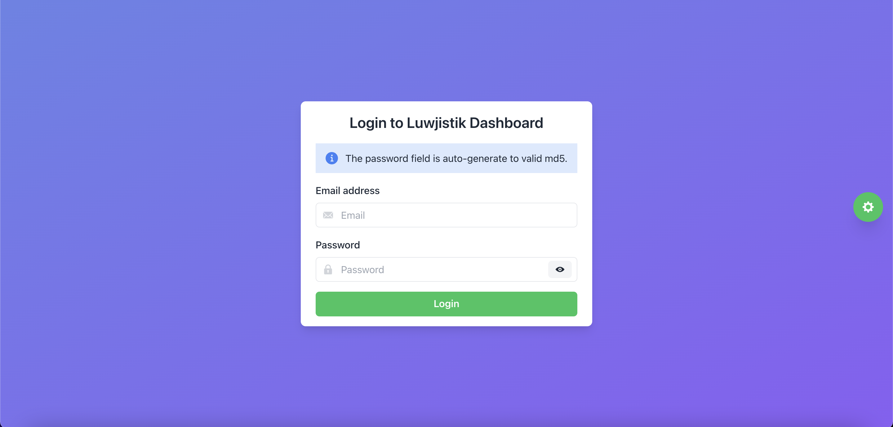
- Login with color variant
  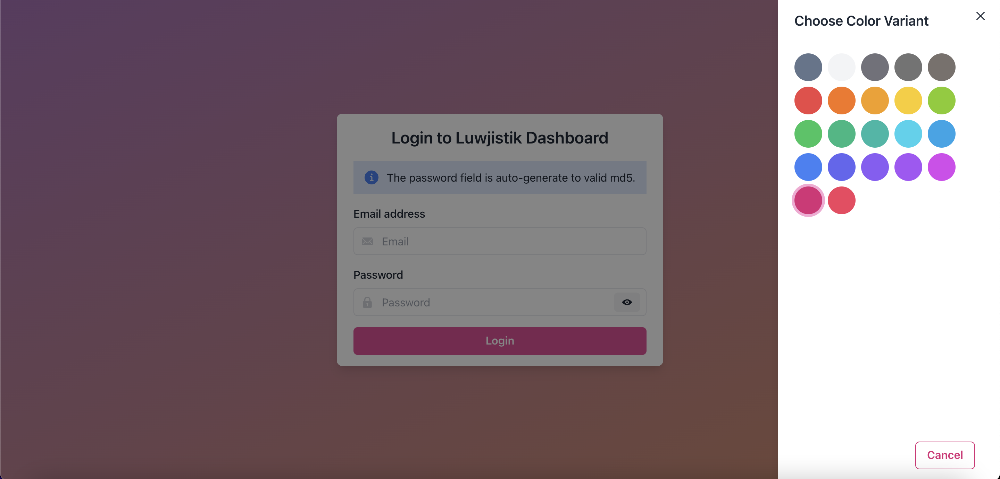
- Dashboard overview
  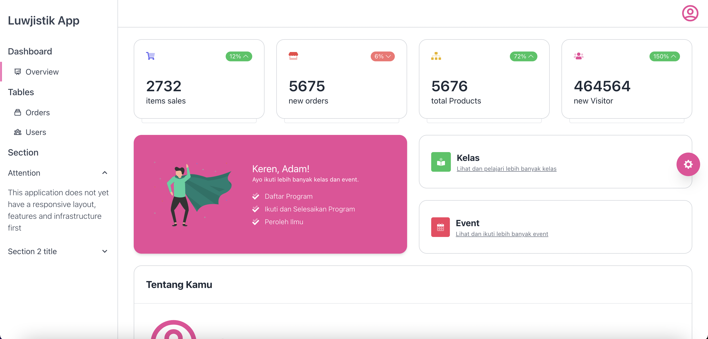
- Dashboard overview after change color variant
  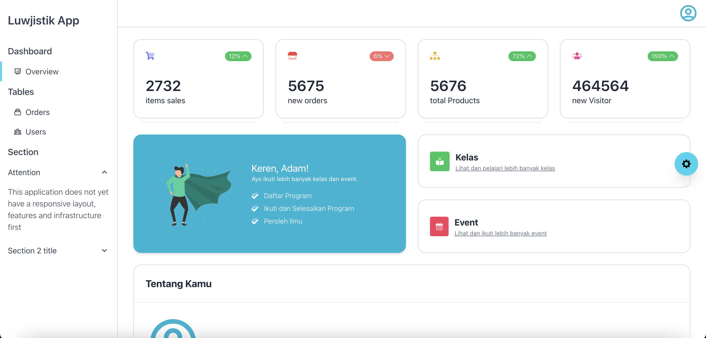
- Table orders empty data
  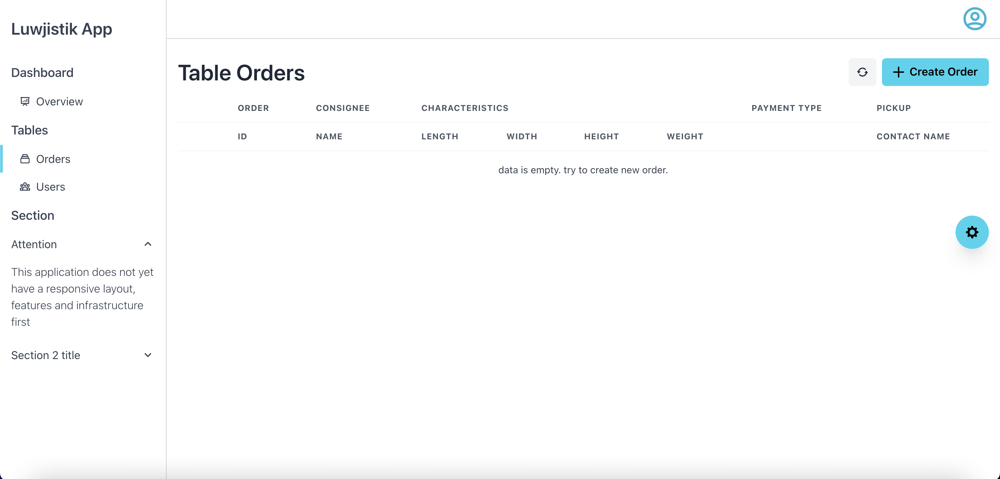
- Table orders with data and row expanded
  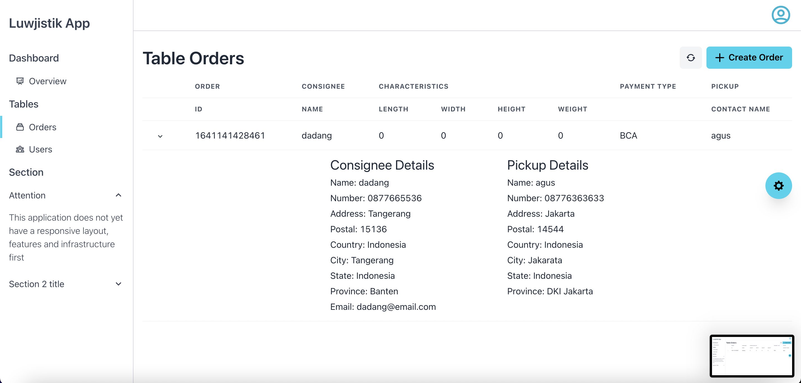
- Create new order form
  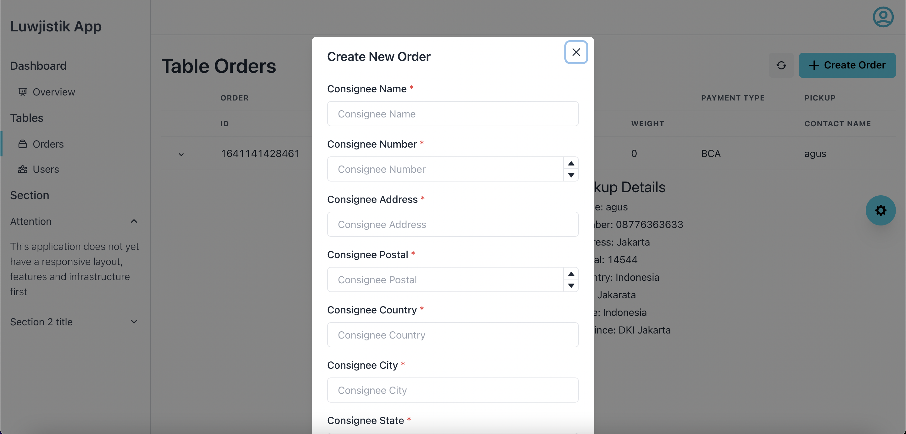
- Create new order success
  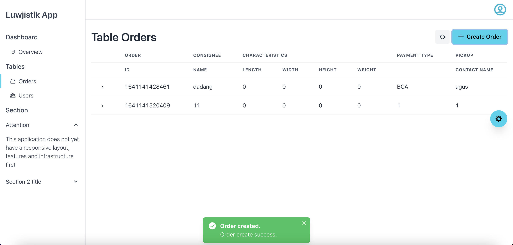
- Dashboard overview resopnsive
  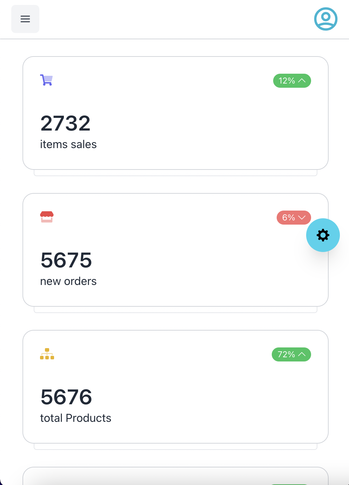
- Table orders resopnsive
  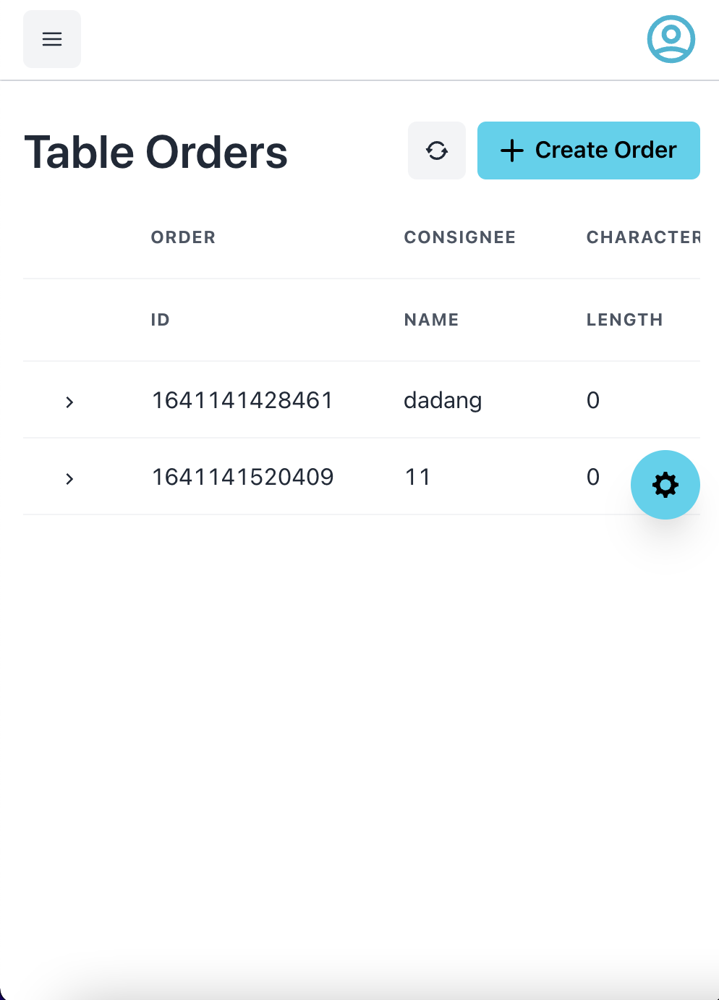
- Sidebar responsive
  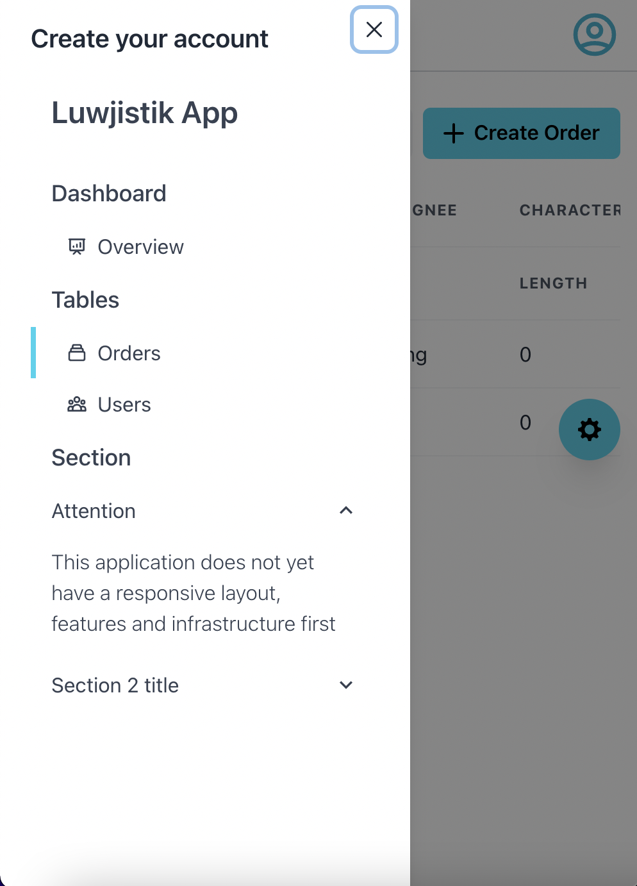
